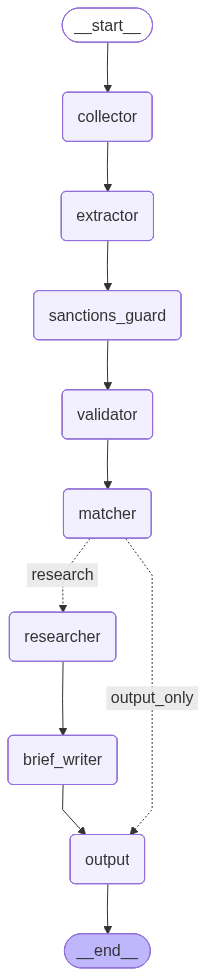
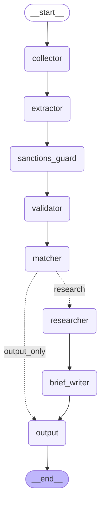

# Investment Radar

An agentic M&A deal scanner built with [LangGraph](https://github.com/langchain-ai/langgraph). It searches the web for mergers and acquisitions news, extracts structured deal data, screens for sanctions compliance, scores deals against a configurable investment thesis, and generates investment briefs for high-scoring deals.

## Architecture

The system is a 7-node LangGraph pipeline with conditional routing:





*This diagram is generated directly from the LangGraph code via `graph.get_graph().draw_mermaid()`.*

## Pipeline Nodes

| Node | File | What it does | API calls |
|------|------|-------------|-----------|
| **Collector** | `nodes/collector.py` | Searches for M&A news from the last 24 hours using Tavily (3 targeted queries, 5 results each) and TinyFish (scrapes Reuters business page). Deduplicates by URL. | 3 Tavily + 1 TinyFish |
| **Extractor** | `nodes/extractor.py` | GPT-4o reads each article and extracts structured deal data: target company, acquirer, deal value, sector, deal type, and strategic rationale. Non-M&A articles return empty. | 1 GPT-4o per article |
| **Sanctions Guard** | `nodes/sanctions_guard.py` | Keyword-based check against sanctioned jurisdictions (Russia, Iran, DPRK, Syria, Cuba). Flagged deals are removed from the pipeline immediately. No LLM call. | 0 |
| **Validator** | `nodes/validator.py` | GPT-4o-mini classifies each deal as confirmed vs. speculation. Deduplicates deals from multiple sources (keeps the most detailed). Checks source reliability. | 1 GPT-4o-mini per deal |
| **Matcher** | `nodes/matcher.py` | GPT-4o scores each deal (0-1) against the investment thesis on 4 criteria: sector alignment, deal type fit, strategic rationale strength, and financial workflow relevance. | 1 GPT-4o per deal |
| **Researcher** | `nodes/researcher.py` | *Only runs for deals above the score threshold.* Performs targeted Tavily searches for supplementary data: competitors, market size, key customers, and funding history. GPT-4o synthesizes findings. | 3 Tavily + 1 GPT-4o per deal |
| **Brief Writer** | `nodes/brief_writer.py` | *Only runs for deals above the score threshold.* GPT-4o generates a 4-section investment brief (Deal Overview, Thesis Alignment, Risk Factors, Recommended Action) using the original article + research. Includes legal disclaimer. | 1 GPT-4o per deal |

### Conditional Routing

After the Matcher scores all deals, a router checks if any deal scored above the threshold (default `0.70`):

- **Above threshold** -- deal goes to Researcher for a deep-dive, then Brief Writer generates a full investment brief
- **Below threshold** -- deal goes straight to Output (logged but no brief)

## Project Structure

```
InvestmentAI/
├── main.py                    # CLI entry point
├── graph.py                   # LangGraph StateGraph definition + routing
├── state.py                   # Pydantic data models + TypedDict state schema
├── config.py                  # API keys, thresholds, search config, sanctions lists
├── requirements.txt           # Python dependencies
├── .env                       # API keys (not committed)
├── .env.example               # Template for .env
├── investmentthesis.md        # Firm's M&A evaluation framework
├── graph_diagram.png          # Auto-generated pipeline diagram
└── nodes/
    ├── __init__.py
    ├── collector.py           # Tavily + TinyFish web search
    ├── extractor.py           # GPT-4o deal extraction
    ├── sanctions_guard.py     # Restricted jurisdiction screening
    ├── validator.py           # Noise filter + deduplication
    ├── matcher.py             # Investment thesis scoring
    ├── researcher.py          # Targeted supplementary research
    └── brief_writer.py        # Investment brief generation
```

## Setup

### Prerequisites

- Python 3.10+
- API keys for OpenAI, Tavily, and TinyFish (optional)

### 1. Clone the repo

```bash
git clone https://github.com/archerdodson/InvestmentAI.git
cd InvestmentAI
```

### 2. Create a virtual environment (recommended)

```bash
python -m venv venv
source venv/bin/activate        # macOS/Linux
venv\Scripts\activate           # Windows
```

Or with conda:

```bash
conda create -n investmentradar python=3.11
conda activate investmentradar
```

### 3. Install dependencies

```bash
pip install -r requirements.txt
```

### 4. Configure API keys

Copy the example env file and add your keys:

```bash
cp .env.example .env
```

Then edit `.env`:

```
OPENAIKEY= "sk-proj-your-openai-key"
Tavily= "tvly-your-tavily-key"
Tinyfish = "sk-tinyfish-your-tinyfish-key"
```

| Key | Required | Where to get it |
|-----|----------|-----------------|
| `OPENAIKEY` | Yes | [platform.openai.com/api-keys](https://platform.openai.com/api-keys) |
| `Tavily` | Yes | [app.tavily.com](https://app.tavily.com) |
| `Tinyfish` | No | [tinyfish.ai](https://www.tinyfish.ai) |

### 5. Run

```bash
python main.py
```

On Windows, if you see Unicode errors:

```bash
set PYTHONIOENCODING=utf-8 && python main.py
```

## Usage

```bash
# Default run (threshold 0.70)
python main.py

# Custom score threshold
python main.py --threshold 0.60

# Add a custom search term
python main.py --query "fintech acquisition"

# Both
python main.py --threshold 0.80 --query "payments"
```

## Example Output

```
======================================================================
  AI-POWERED INVESTMENT RADAR
  M&A Deal Scanner | Thesis Matcher | Brief Generator
======================================================================

NODE: COLLECTOR — Searching for M&A news (last 24h)
  [Tavily] Search 1/3: "mergers acquisitions announced today"  -> Found 5 results
  [Tavily] Search 2/3: "startup acquisition deal"              -> Found 5 results
  [Tavily] Search 3/3: "M&A deal closed"                       -> Found 5 results
  [TinyFish] Scraping: https://www.reuters.com/business/        -> Extracted 1 items

NODE: EXTRACTOR — Extracting structured deal data
  -> DEAL: Santander -> Webster Financial ($12.2B) [Financial Services]
  -> DEAL: Accenture -> Ookla ($1.2B) [Connectivity]
  ...

NODE: SANCTIONS GUARD — Screening for restricted jurisdictions
  OK: Webster Financial — no sanctions flags

NODE: MATCHER — Scoring deals against investment thesis
  [0.77] Moderate | Santander -> Webster Financial **
  [0.39] Weak     | Medimaps -> Radiobotics
  ...

NODE: RESEARCHER — Deep-dive on high-scoring deals
  Competitors: JPMorgan Chase, Bank of America, Citizens Financial
  Market Size: $28.5T US banking assets
  Key Customers: Small businesses, commercial clients in Northeast US

NODE: BRIEF WRITER
  ┌─────────────────────────────────────────────────────┐
  │ INVESTMENT BRIEF: Santander -> Webster Financial    │
  │ Deal Overview: ...                                  │
  │ Thesis Alignment: ...                               │
  │ Risk Factors: ...                                   │
  │ Recommended Action: ...                             │
  └─────────────────────────────────────────────────────┘
```

## Investment Thesis

The system scores deals against `investmentthesis.md`, which defines:

- **Deal classification tiers** (Mega-Deal >$10B, Large-Cap $1-10B, Mid-Market $250M-1B, Small-Cap <$250M)
- **Strategic rationale types** (horizontal integration, vertical integration, market extension, product extension, conglomerate diversification, transformative/platform)
- **Compliance screening** (sanctions, AML/KYC, anti-bribery, antitrust, ESG)
- **Financial criteria** (EBITDA margins, revenue growth, EV/EBITDA multiples, leverage)

The Matcher scores each deal on 4 criteria (0-1 each):

1. **Sector alignment** -- financial services, fintech, regulated workflows
2. **Deal type fit** -- matches recognised M&A structures
3. **Strategic rationale strength** -- clear, quantifiable, defensible
4. **Financial workflow relevance** -- automates high-volume regulated workflows

## Guardrails

| Guardrail | Where | What it does |
|-----------|-------|-------------|
| Sanctions screening | `sanctions_guard.py` | Hard stop for deals with nexus to Russia, Iran, DPRK, Syria, Cuba |
| Legal disclaimer | `brief_writer.py` | All briefs include "not investment advice" disclaimer |
| No-advice language | `brief_writer.py` | Blocks "Strong Buy" / "We recommend" phrasing |
| Financial reality | `brief_writer.py` | Flags EV/EBITDA multiples > 50x for manual review |

## Regenerating the Diagram

The pipeline diagram is generated from the live LangGraph code:

```python
from graph import build_graph

g = build_graph()

# Mermaid markdown
print(g.get_graph().draw_mermaid())

# PNG file
png = g.get_graph().draw_mermaid_png()
with open("graph_diagram.png", "wb") as f:
    f.write(png)
```

## License

MIT
